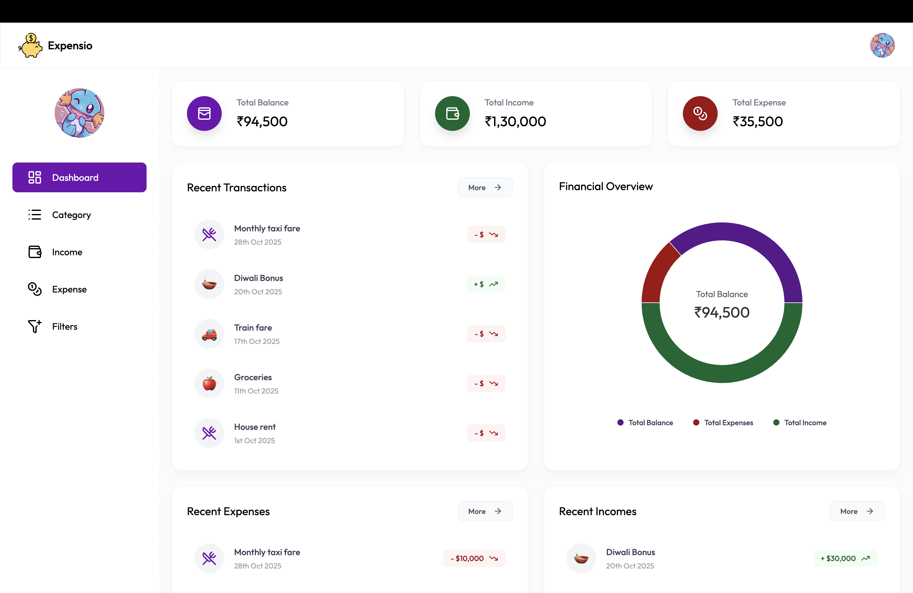
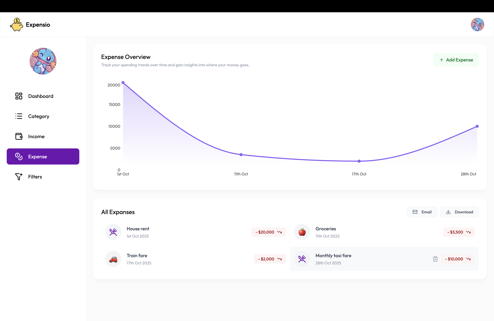

# 💰 Expensio - Money Manager

A full-stack **Income and Expense Tracker** built with **React.js**, **Spring Boot**, and **MySQL**, designed to help users manage their finances effectively.  
The app allows users to add, edit, and delete income and expense records, view detailed analytics, and download or email transaction reports — all in one beautiful and intuitive interface.

🌐 **Live Demo:** [https://expensio8.netlify.app](https://expensio8.netlify.app)

---

## 🧭 Project Overview

Expensio is a personal finance management web app that helps you:

- Track your **income and expenses** in real time  
- Get a **visual overview** of your financial health  
- Filter transactions by date and category  
- Receive **daily email reminders** about your spending habits  
- Export your data via **Excel or email**  

It’s fully responsive, fast, and deployed using **Render (backend)** and **Netlify (frontend)**.

---

## 🛠️ Tech Stack

### Frontend
- ⚛️ **React.js**
- 🎨 **Tailwind CSS**
- 🔥 **React Hot Toast** (for notifications)
- 📊 **React Charts** (for analytics)
- 😄 **Emoji Picker**
- 🧭 **Lucide React** (for icons)
- 🌐 **Axios** (for API calls)

### Backend
- ☕ **Spring Boot**
- 🗄️ **Spring Data JPA**
- 🧾 **MySQL Database**
- 🔐 **Spring Security with JWT Authentication**
- ☁️ **Cloudinary** (for profile image uploads)
- 📤 **Email API** (for transaction and reminder emails)

---

## 🔧 Features

✅ Register & Login with JWT Authentication  
✅ Upload profile picture to Cloudinary  
✅ Add, edit, and delete **Income & Expense** records  
✅ Category management with emoji icons  
✅ Category filtering and transaction sorting  
✅ Download & Email transactions in Excel format  
✅ Real-time **toast notifications**  
✅ Loading states with spinners and icons  
✅ Responsive and modern UI built with Tailwind  
✅ Deployed frontend on **Netlify**, backend on **Render**

---

## 📸 Screenshots

### 🧾 Signup Page  

### 📊 Dashboard  

### 💸 Expense Overview  

---

## 🚀 Deployment

- **Frontend:** [Netlify](https://www.netlify.com/)
- **Backend:** [Render](https://render.com/)
- **Database:** MySQL